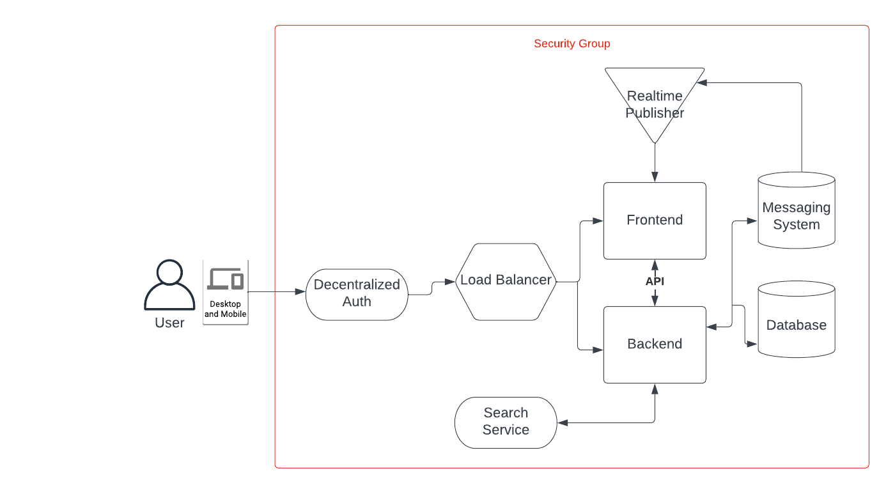

# Week 0 — Billing and Architecture

Created Conceptual Diagram in LucidChart

Created IAM user and group, generated access key

Connected with AWS CLI - verified with command `aws sts get-caller-identity`

Created billing alarm with click ops - this shows us the commands to do the same with the CLI https://github.com/omenking/aws-bootcamp-cruddur-2023/blob/week-0/journal/week0.md

Started work on architectural diagram - imported momento svg, found all the elements but have not yet arranged them on screen (TODO)

Watch video from "Cloud Security Podcast"
